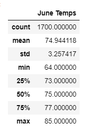
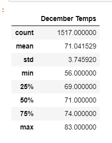

# surfs_up

## Overview of Analysis

The aim of this project is to create an statistical analysis of the temperatures on Oahu Hawai from the months of June and December. This helps to determine whether or not the surf and ice cream shop business is sustainable throughout the year. By creating a query that captures the temperatures specifically for the months of June and December, we can obtain data such as average, maximum, and minimum temperatures.

## Results

### June Analysis
According to the analysis, we can notice that there are 1,700 observations for June for the years between 2010 and 2017. The average, minimum, and maximum temperatures are shown below. The standard deviation tell us that there is a relatively small spread from the mean across the temperature observations. This makes sense since Oahu weather does not seem to be very variable.

### December Analysis
Looks like December only have 1517 observations. This mean that some of the dates are missing temperature recordings. But this still a large sample size to create an analysis. From the tables, we can notice that June and December are close in average, maximum, and minimum temperature. More importantly, the spread is about the same as the spread for the month of June.

## Summary

If we compare the statistic analysis summary of the two months, we would be able to conclude that temperature patterns are steady throughout the whole year. However, there are two more queries that we need to include to get a better idea of the weather on Oahu. In spite of the fact that temperatures remain about the same throughout the year, precipitation may not and would also have a big effect of the business's sustainability. Doing summary of the precipitation within the months of June and December will give us a better understanding of the weather behavior.

